<div align="center">

<!-- PORTRAIT - generated by scripts/dotify.py from assets/portrait.jpg.
     Colour mode, so one file serves both GitHub themes. Regenerate with:
       python scripts/dotify.py assets/portrait.jpg -o assets/portrait \
         --square --focus 0.55,0.40 --cols 95 --equalize --detail 0.5 --color --reveal -->

<br>

<!-- NAME / TAGLINE - animated typing banner -->
<a href="https://github.com/ssambit635-svg">
  
</a>

<br>

<!-- SOCIALS -->
<a href="https://www.linkedin.com/in/sambit-swain-7032a8378"></a>
<a href="mailto:ssambit635@gmail.com"></a>
<a href="https://ssambit635-svg.github.io/portfolio.site/"></a>


</div>

---

## `~/` whoami

```console
$ cat about.txt
```

Hi, I'm **Sambit Swain** — a developer from **Berhampur, Odisha** with a **night owl** rhythm. I believe in hands-on building: learning technologies not through passive theory, but by shipping real projects, breaking things, and figuring them out as I go.

- 🔭 Currently building **a personal AI that manages and organizes files**
- ⚡ Currently learning **Full Stack Development & Cloud Architecture (AWS)**
- 🌐 Portfolio: **[ssambit635-svg.github.io/portfolio.site](https://ssambit635-svg.github.io/portfolio.site/)**
- 🏆 Hackathons: **SIH 2026** (Annadata-Connect) & **Tech Zypher 2026** (Shadow Quest)
- 💡 Philosophy: **Write code, ship to a live URL, and iterate with real feedback.**

<br>

<div align="center">

## `~/` toolbox


</div>

---

<div align="center">

## `~/` skill radar

<table>
<tr>
<td width="50%" align="center" valign="middle">

<!-- Self-rated radar - edit assets/skills.json, the workflow redraws it -->
<picture>
  <source media="(prefers-color-scheme: dark)"  srcset="assets/radar-dark.svg">
  <source media="(prefers-color-scheme: light)" srcset="assets/radar-light.svg">
  
</picture>

</td>
<td width="50%" align="center" valign="middle">

<!-- Live radar built from real language byte counts across your repos -->
<picture>
  <source media="(prefers-color-scheme: dark)"  srcset="assets/radar-langs-dark.svg">
  <source media="(prefers-color-scheme: light)" srcset="assets/radar-langs-light.svg">
  
</picture>

</td>
</tr>
</table>

</div>

---

<div align="center">

## `~/` contribution pulse

<!-- One lens only: Conway's Game of Life seeded by real commit days, with an ECG
     heartbeat sweeping across that "eats" each week of contributions and lets it
     regrow behind. Drawn by scripts/contribgraph.py (.github/workflows/graph.yml). -->
<picture>
  <source media="(prefers-color-scheme: dark)"  srcset="assets/graph-life-dark.svg">
  <source media="(prefers-color-scheme: light)" srcset="assets/graph-life-light.svg">
  
</picture>

</div>

---

<div align="center">

## `~/` the numbers

<!-- Generated by scripts/cards.py into this repo. Deliberately self-hosted
     so third-party uptime outages never break the profile. -->
<picture>
  <source media="(prefers-color-scheme: dark)"  srcset="assets/card-stats-dark.svg">
  <source media="(prefers-color-scheme: light)" srcset="assets/card-stats-light.svg">
  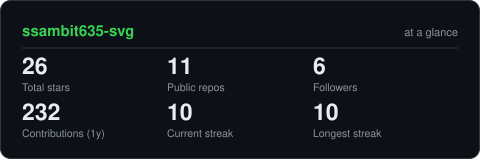
</picture>

<br>

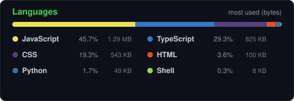

<br><br>

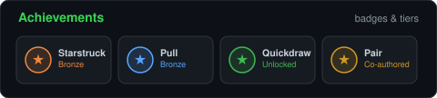

</div>

---

<div align="center">

## `~/` selected work

<!-- Cards generated by scripts/cards.py from assets/projects.json.
     Stars, forks and language are pulled live from the API on every run. -->
<table>
<tr>
<td width="50%">
  <a href="https://github.com/ssambit635-svg/ssambit635-svg-Annadata-Connect">
    <picture>
      <source media="(prefers-color-scheme: dark)"  srcset="assets/card-ssambit635-svg-Annadata-Connect-dark.svg">
      <source media="(prefers-color-scheme: light)" srcset="assets/card-ssambit635-svg-Annadata-Connect-light.svg">
      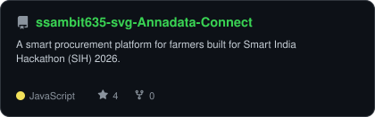
    </picture>
  </a>
</td>
<td width="50%">
  <a href="https://github.com/ssambit635-svg/Shadow-quest">
    <picture>
      <source media="(prefers-color-scheme: dark)"  srcset="assets/card-Shadow-quest-dark.svg">
      <source media="(prefers-color-scheme: light)" srcset="assets/card-Shadow-quest-light.svg">
      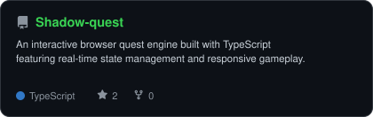
    </picture>
  </a>
</td>
</tr>
<tr>
<td width="50%">
  <a href="https://github.com/ssambit635-svg/Aws-dashboard-frontend">
    <picture>
      <source media="(prefers-color-scheme: dark)"  srcset="assets/card-Aws-dashboard-frontend-dark.svg">
      <source media="(prefers-color-scheme: light)" srcset="assets/card-Aws-dashboard-frontend-light.svg">
      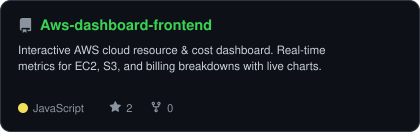
    </picture>
  </a>
</td>
<td width="50%">
  <a href="https://github.com/ssambit635-svg/Weather-sense">
    <picture>
      <source media="(prefers-color-scheme: dark)"  srcset="assets/card-Weather-sense-dark.svg">
      <source media="(prefers-color-scheme: light)" srcset="assets/card-Weather-sense-light.svg">
      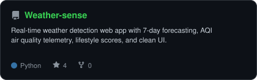
    </picture>
  </a>
</td>
</tr>
</table>

<sub>

| project | live | stack |
|---|---|---|
| **[Annadata-Connect](https://github.com/ssambit635-svg/ssambit635-svg-Annadata-Connect)** | [annadata-connect.onrender.com](https://ssambit635-svg-annadata-connect.onrender.com/) | `JavaScript` `Node.js` `Express` `SIH 2026` |
| **[Shadow Quest](https://github.com/ssambit635-svg/Shadow-quest)** | [shadowquest.onrender.com](https://shadowquest.onrender.com/) | `TypeScript` `Gamified Todo` `Tech Zypher 2026` |
| **[AWS Serverstats Dashboard](https://github.com/ssambit635-svg/Aws-dashboard-frontend)** | [aws-dashboard-frontend.vercel.app](https://aws-dashboard-frontend.vercel.app/) | `React` `FastAPI` `AWS EC2/S3` `Docker` |
| **[Weather Sense](https://github.com/ssambit635-svg/Weather-sense)** | [weather-sense.streamlit.app](https://weather-sense-pbwmsehcq8etxhy7vufp6i.streamlit.app/) | `Python` `Streamlit` `Open-Meteo` |

</sub>

</div>

---

<div align="center">

<sub>`01110100 01101000 01100001 01101110 01101011 01110011 00100000 01100110 01101111 01110010 00100000 01110011 01100011 01110010 01101111 01101100 01101100 01101001 01101110 01100111`</sub>

</div>
