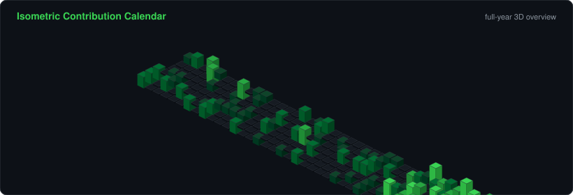
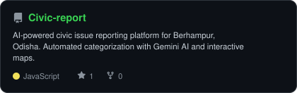

<div align="center">

<!-- PORTRAIT - generated by scripts/dotify.py from assets/portrait.jpg.
     Colour mode, so one file serves both GitHub themes. Regenerate with:
       python scripts/dotify.py assets/portrait.jpg -o assets/portrait \
         --square --focus 0.55,0.40 --cols 90 --equalize --detail 0.5 --color --reveal -->


<br>

<!-- NAME / TAGLINE - animated typing banner -->
<a href="https://github.com/ssambit635-svg">
  
</a>

<br>

<!-- SOCIALS -->
<a href="https://www.linkedin.com/in/sambit-swain-7032a8378"></a>
<a href="mailto:ssambit635@gmail.com"></a>
<a href="https://ssambit635-svg.github.io/portfolio.site/"></a>
<a href="https://x.com/swainsambit7i"></a>
<a href="https://hashnode.com/@ssambit"></a>


</div>

---

## `~/` whoami

```console
$ cat about.txt
```

Hi, I'm **Sambit Swain**. I'm a B.Tech CSE student at **NIST University, Berhampur** focused on Cloud, DevOps, and Full-Stack web development. I love building real things that people can open in a browser right now.

- 🔭 Currently building **[AWS Resource Dashboard](https://github.com/ssambit635-svg/Aws-dashboard-frontend)** and **[CivicReport](https://github.com/ssambit635-svg/Civic-report)**
- 🌐 Portfolio: **[ssambit635-svg.github.io/portfolio.site](https://ssambit635-svg.github.io/portfolio.site/)**
- ⚡ Learning **Cloud Architecture (AWS) + System Design & CI/CD**
- 💬 Ask me about **Python, TypeScript, React, Docker, and Cloud Deployment**
- 🎯 Fun fact: **I learn faster by breaking things and reading the logs than by passively watching tutorials.**

<br>

<div align="center">

## `~/` toolbox


</div>

---

<div align="center">

## `~/` skill radar

<table>
<tr>
<td width="50%" align="center" valign="middle">

<!-- Self-rated radar - edit assets/skills.json, the workflow redraws it -->
<picture>
  <source media="(prefers-color-scheme: dark)"  srcset="assets/radar-dark.svg">
  <source media="(prefers-color-scheme: light)" srcset="assets/radar-light.svg">
  
</picture>

</td>
<td width="50%" align="center" valign="middle">

<!-- Live radar built from real language byte counts across your repos -->
<picture>
  <source media="(prefers-color-scheme: dark)"  srcset="assets/radar-langs-dark.svg">
  <source media="(prefers-color-scheme: light)" srcset="assets/radar-langs-light.svg">
  
</picture>

</td>
</tr>
</table>

</div>

---

<div align="center">

## `~/` contribution calendar

<!-- 3D isometric calendar, regenerated every 6h by .github/workflows/metrics.yml -->


<br><br>

<!-- Snake eats the contribution graph - .github/workflows/snake.yml -->
<picture>
  <source media="(prefers-color-scheme: dark)"  srcset="https://raw.githubusercontent.com/ssambit635-svg/Ssambit635-svg/output/snake-dark.svg">
  <source media="(prefers-color-scheme: light)" srcset="https://raw.githubusercontent.com/ssambit635-svg/Ssambit635-svg/output/snake.svg">
  
</picture>

</div>

---

<div align="center">

## `~/` the numbers

<!-- Generated by scripts/cards.py into this repo. Deliberately NOT
     github-readme-stats / streak-stats / github-profile-trophy: those are
     shared public instances that go down and take the whole section with them. -->
<picture>
  <source media="(prefers-color-scheme: dark)"  srcset="assets/card-stats-dark.svg">
  <source media="(prefers-color-scheme: light)" srcset="assets/card-stats-light.svg">
  
</picture>

<br>


<br><br>


</div>

---

<div align="center">

## `~/` selected work

<!-- Cards generated by scripts/cards.py from assets/projects.json.
     Stars, forks and language are pulled live from the API on every run. -->
<table>
<tr>
<td width="50%">
  <a href="https://github.com/ssambit635-svg/Aws-dashboard-frontend">
    <picture>
      <source media="(prefers-color-scheme: dark)"  srcset="assets/card-Aws-dashboard-frontend-dark.svg">
      <source media="(prefers-color-scheme: light)" srcset="assets/card-Aws-dashboard-frontend-light.svg">
      
    </picture>
  </a>
</td>
<td width="50%">
  <a href="https://github.com/ssambit635-svg/Weather-sense">
    <picture>
      <source media="(prefers-color-scheme: dark)"  srcset="assets/card-Weather-sense-dark.svg">
      <source media="(prefers-color-scheme: light)" srcset="assets/card-Weather-sense-light.svg">
      
    </picture>
  </a>
</td>
</tr>
<tr>
<td width="50%">
  <a href="https://github.com/ssambit635-svg/Civic-report">
    <picture>
      <source media="(prefers-color-scheme: dark)"  srcset="assets/card-Civic-report-dark.svg">
      <source media="(prefers-color-scheme: light)" srcset="assets/card-Civic-report-light.svg">
      
    </picture>
  </a>
</td>
<td width="50%">
  <a href="https://github.com/ssambit635-svg/Shadow-quest">
    <picture>
      <source media="(prefers-color-scheme: dark)"  srcset="assets/card-Shadow-quest-dark.svg">
      <source media="(prefers-color-scheme: light)" srcset="assets/card-Shadow-quest-light.svg">
      
    </picture>
  </a>
</td>
</tr>
</table>

<sub>

| project | live | stack |
|---|---|---|
| **[AWS Resource Dashboard](https://github.com/ssambit635-svg/Aws-dashboard-frontend)** | [aws-dashboard-frontend.vercel.app](https://aws-dashboard-frontend.vercel.app) | `React` `FastAPI` `AWS` `Docker` |
| **[Weather Sense](https://github.com/ssambit635-svg/Weather-sense)** | [weather-sense.streamlit.app](https://weather-sense-pbwmsehcq8etxhy7vufp6i.streamlit.app/) | `Python` `Streamlit` `Open-Meteo` |
| **[CivicReport](https://github.com/ssambit635-svg/Civic-report)** | [ssambit635-svg.github.io/Civic-report](https://ssambit635-svg.github.io/Civic-report/) | `JavaScript` `Gemini AI` `Leaflet.js` |
| **[Shadow Quest](https://github.com/ssambit635-svg/Shadow-quest)** | [github.com/ssambit635-svg/Shadow-quest](https://github.com/ssambit635-svg/Shadow-quest) | `TypeScript` `Game Engine` `State Machine` |

</sub>

</div>

---

<div align="center">

<sub>`01110100 01101000 01100001 01101110 01101011 01110011 00100000 01100110 01101111 01110010 00100000 01110011 01100011 01110010 01101111 01101100 01101100 01101001 01101110 01100111`</sub>

</div>
